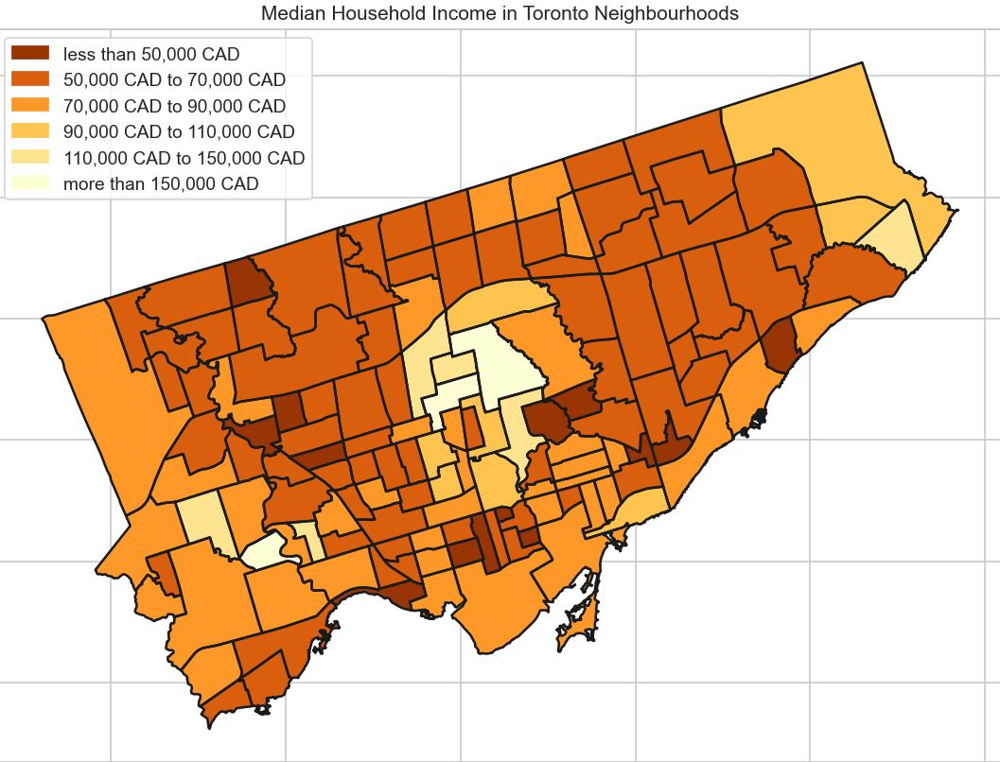
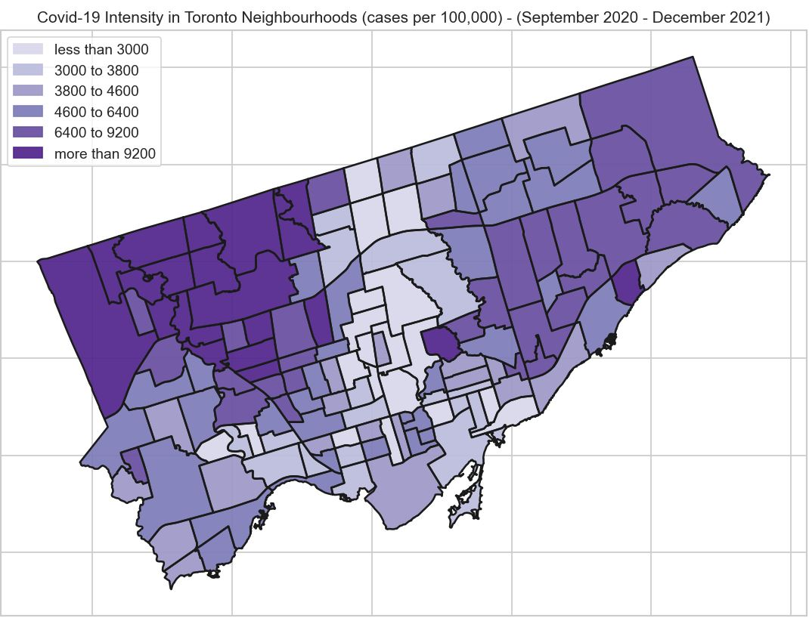
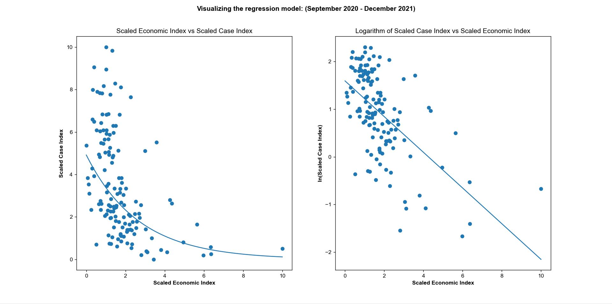

# COVID-19 Socio-Economic Modelling
#### **Copyright © 2021 Harvey Ronan Donnelly and Ewan Robert Jordan.**
## Project Overview
This software is designed to generate models to investigate the relationship between COVID-19 case numbers and the socio-economic background of various urban regions. We have focussed on the City of Toronto for our concrete implementation, although the software is designed to facilitate other urban regions. The software will generate regression models and heatmaps visualising the relevant data in order to address the chosen research question.

## Run Instructions
1. Clone repository:
```
git clone https://github.com/HarveyRDonnelly/CovidSocioEconomicModel
```
2. Install python dependencies:
```
pip install -r requirements.txt
```
3. Run Data Collection module:
```
python3 modules/data_collection.py
```
4. Execute the run file:
```
python3 main.py
```

## Expected Output
#### Median Household Income in Toronto Neighbourhoods

#### Cases in Toronto Neighbourhoods

#### Regression Analysis


## Research Problem
There is a precedent of socio-economic disparities occurring in relation to issues of public health in the US and Canada. For example, the Canadian Cancer Registry found that there is a greater incidence rate of lung cancer within low-income Canadians compared to higher-income Canadians (Hajizadeh et al., 2020). Furthermore, there is a demonstrated relationship between income inequality and coronary heart disease within the US (Lemstra et al. 2015). Given these trends, it is clearly important to consider socio-economic disparities when attempting to address public health issues.

The COVID-19 pandemic began in early 2020, leading to millions of deaths and hospitalisations across the globe (WHO Coronavirus (COVID-19) Dashboard, 2021). We hypothesise that there exists a correlation between the impact of COVID-19 in a community and the socio-economic grouping of that community. Therefore, our research question is, **“Has the pandemic disproportionately impacted low-income households in the City of Toronto?”**

Reliable data for the socio-economic background of each individual COVID-19 case in the City of Toronto does not exist. Thus, we will divide the city’s population into sub-regions (i.e. neighbourhoods) and then examine the median household income for each. We will then analyse the COVID-19 cases per capita across sub-regions for the largest possible time interval with reliable testing data. We will investigate this by designing bespoke computational regression models to determine whether a trend exists.

We have chosen this research question because of its importance in relation to mitigating the impact of future pandemics. Before we can attempt to understand why certain sections of society were worse-affected than others, we must first determine which sections of society were worse-affected than others. Hence, it is imperative to know whether such a correlation exists in order to inform future policy and decision-making. If our hypothesis is shown to be true, then we will have demonstrated that addressing socio-economic inequality should be the main priority for policymakers when preparing for future pandemics.

## Computational Overview

We have designed software to evaluate whether there is a correlation between the Median Household Income and the COVID-19 cases per capita for each neighbourhood in the City of Toronto. Our software uses a variety of computa- tional methods to generate insightful visualisations and to complete a regression analysis on the relevant data. The aim of our software is to provide evidence to justify a thesis that answers our research question.

Firstly, we will outline our use of automated data collection. The COVID-19 Cases and Neighbourhood Bound- aries datasets can be easily obtained in a usable format from the City of Toronto Open Data Catalogue. However, the City of Toronto only publishes the pre-Tax Median Household Income data as part of a “Neighbourhood Profile” PDF document for each individual neighbourhood. Therefore, we have designed a custom Data Collection module (modules/data collection.py) which downloads and extracts the relevant data from all 140 neighbourhood profile PDF files. This task is completed with use of the external library tabula (Tabula-Py Documentation, 2021). The module then formats the data into a usable .csv file and carries out string manipulation operations to ensure that the same “Neighbourhood Name” values are used across datasets.

We will now detail the use of custom class entities. The Entities Module (modules/entities.py) is responsible for defining the abstract and concrete classes used by our software to represent the data being analysed. We have structured our project to analyse trends for a SuperRegion (i.e. the City of Toronto) and the multiple instances of a SubRegion that it possesses (i.e. a neighbourhood). The use of these generalised parent classes allows for our software to be easily expanded in the future to generate similar models for other scopes of super-regions and sub-regions (e.g. a country and its provinces). We have implemented concrete classes that inherit these generalised classes to work for the City of Toronto, such as the City and Neighbourhood classes. We have also implemented a concrete CovidCase class to represent each COVID-19 case. These classes are implemented with a variety of useful methods, such as SuperRegion.add sub region(...).

We will now describe our use of data transformation methods to format, filter and aggregate raw data. The Data Loading Module (modules/data loading.py) is responsible for reading the raw data directly from the relevant .csv files and loading it into the correct class entities for the software. In this process, the module filters out fields of data that are not relevant to the model, such as the gender of each COVID-19 case. Attributes of data from different datasets are aggregated into single class entities. The initializer functions and methods for each class also carry out some necessary computations on the loaded data. For example, the number of cases per capita for a SubRegion is recalculated from its population every time a new CovidCase is added using the SubRegion.add covid case(...) method.

We will now delineate our use of scaled economic and COVID-19 case indexes. It is our intention for our software to have utility beyond the immediate scope of our research question. For example, it may be useful to compare similar correlations between different urban regions, such as Toronto and New York. As different super-regions will have different ranges of pre-Tax Median Household Income and COVID-19 cases per capita, a scaled variable must be used for comparison purposes. For this reason, we have designed an algorithm for calculating scaled values for the two variables that we are investigating, such that they correspond to a scale between 0 and 10. That is, the sub-region with the highest median household income will always have a scaled economic index of 10 and the sub-region with the lowest will always have a scaled economic index of 0. All other sub-regions will have scaled economic indexes proportionately distributed within these two values. The below formula illustrates how this is calculated for both COVID-19 cases and median household income:
```
Scaled Multiplier = 10
Max. Value − Min. Value
Scaled Index = (Original Value − Min. Value) · Scaled Multiplier
```
We will now outline our implementation of linear and exponential regression from scratch. The Regression Module (modules/regression.py) is responsible for carrying out the regression analysis of the formatted data. From observation of the raw data, we hypothesized that there exists an exponential correlation between the scaled case and economic indexes, which represent COVID-19 cases per capita and median household income respectively. As such, we designed a class for generating an exponential regression model. This is equivalent to conducting linear regression within the domain of a natural logarithm:

```
y = a · bx
ln(y) = x · ln(b) + ln(a)
```

Thus, the exponential regression algorithm simply carries out a linear regression analysis for the natural loga- rithm of the scaled case index against the scaled economic index. In designing the linear and exponential regression algorithms, we only used an abstract understanding of the concepts of regression and so no external code was used. The returned residual-squared value of the best fitting function from the regression analysis will indicate how strong any correlation is.

We will now explain how our software generates insightful visualizations from the formatted data. The responsi- bility for this aspect of the software belongs to the Visualizations Module (modules/visualizer.py). This module uses the Neighbourhood Boundaries dataset to generate heatmap graphics of the City of Toronto, showing the ge- ographical distribution of Median Household Income and COVID-19 cases per capita. To visually represent the geographical boundaries of the City of Toronto from the shapefiles in the dataset, we have used the external libraries matplotlib (Matplotlib, 2021), shapefile (Lawhead, 2021) and seaborn (Seaborn: Statistical Data Visualization, 2021). This module also generates graphics of the raw data coordinates plotted alongside the exponential function derived from regression analysis. It generates graphics for both the exponential regression and the linear regression of the natural logarithm coordinates. These visualisations are the most important for assessing whether a correlation exists.

## References
1. Hajizadeh, M., Johnston, G., & Manos, D. (2020). Socio-economic inequalities in lung cancer incidence in Canada, 1992–2010: results from the Canadian Cancer Registry. Public Health, 185, 189–195. https://doi.org/10.1016/j.puhe.2020.04.023
2. Lemstra, M., Rogers, M., & Moraros, J. (2015). Income and heart disease: Neglected risk factor. Canadian family physician Medecin de famille canadien, 61(8), 698–704. https://www.ncbi.nlm.nih.gov/pmc/articles/PMC4541436/
3. WHO Coronavirus (COVID-19) Dashboard. (2021). World Health Organization. https://covid19.who.int
4. Neighbourhood Profiles. (2021, April 1). City of Toronto. https://www.toronto.ca/city-government/data-research-maps/neighbourhoods-communities/neighbourhood-profiles/
5. Open Data Dataset. (2021a). City of Toronto Open Data Portal. https://open.toronto.ca/dataset/covid-19-cases-in-toronto/
6. Open Data Dataset. (2021b). City of Toronto Open Data Portal. https://open.toronto.ca/dataset/neighbourhoods/
7. Matplotlib (2021). Matplotlib. https://matplotlib.org
8. seaborn: statistical data visualization (2021). Seaborn. https://seaborn.pydata.org
9. tabula-py documentation. (2021). Tabula. https://tabula-py.readthedocs.io/en/latest/
10. Lawhead, J. (2021). Python Shapefile Library. Shapefile Documentation. https://pythonhosted.org/Python%20Shapefile%20Library/

#### **Copyright (c) 2021 Harvey Ronan Donnelly and Ewan Robert Jordan.**
